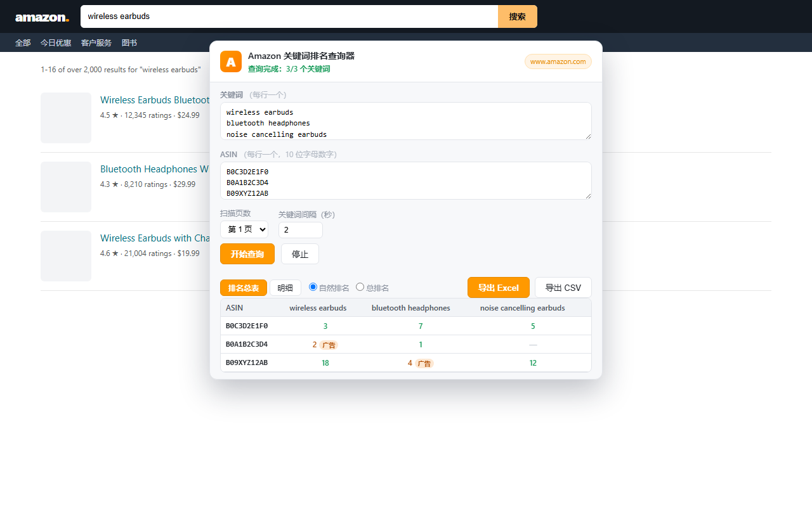

# Amazon 关键词排名查询器（Chrome 扩展）

批量输入**关键词**与 **ASIN**，自动在亚马逊搜索结果页查询每个 ASIN 的排名（总排名 / 自然排名，广告位自动标记），并一键**导出 Excel / CSV**。

> English: [README.en.md](README.en.md) · 商店上架材料（可直接复制提交 CWS）：[store-listing.md](store-listing.md) · 隐私政策：[privacy-policy.html](privacy-policy.html) · 界面演示：[demo/preview.html](demo/preview.html)



## 功能

- 🗂 **批量查询**：一次输入任意多个关键词 × 任意多个 ASIN，自动逐个关键词打开搜索页（后台标签页，不打扰当前页面）
- 🏷 **广告位识别**：自动区分广告位（Sponsored）与自然位，总排名 / 自然排名双口径
- 🌍 **多站点支持**：`.com` / `.co.uk` / `.de` / `.fr` / `.it` / `.es` / `.co.jp` / `.ca` / `.com.mx` / `.com.au` / `.in` / `.com.br` / `.nl` / `.se` / `.pl` / `.com.tr` / `.sg` / `.ae` / `.sa` / `.eg` / `.co.th` 等主流站点
- 📄 **多页扫描**：可选扫描搜索结果的第 1 / 前 2 / 前 3 页（跨页去重、保留最小排名）
- ⏱ **防风控**：关键词之间可配置间隔（默认 2 秒）；遇到亚马逊验证码（Captcha）会标记该关键词并继续
- 📊 **结果视图**：排名总表（ASIN × 关键词矩阵，可切换自然/总排名）、完整明细（标题、价格、链接、广告标记）
- 💾 **导出**：一键导出 Excel（.xlsx，含「排名汇总 / 完整明细 / 未找到清单」三个工作表）或 CSV
- ♻️ **断点续跑**：任务状态持久化，插件后台被系统回收后可自动续跑；关闭弹窗不影响任务进行

## 安装（开发者模式加载）

1. 打开 Chrome，地址栏输入 `chrome://extensions` 回车
2. 打开右上角 **开发者模式** 开关
3. 点击 **加载已解压的扩展程序**，选择本目录：`amazon-rank-tracker`（即包含 `manifest.json` 的文件夹）
4. 安装完成后，浏览器右上角会出现橙色 **A** 图标

## 使用步骤

1. 先在浏览器打开一个**亚马逊站点**页面（例如 `https://www.amazon.com`，最好是已登录状态）。插件会把「当前打开的亚马逊站点」当作查询市场。
2. 点击工具栏的橙色 **A** 图标打开插件弹窗：
   - **关键词**：每行一个（如 `wireless earbuds`、`bluetooth headphones`）
   - **ASIN**：每行一个 10 位字母数字（如 `B0C1234567`）
   - 可选：扫描页数、关键词间隔秒数
3. 点击 **开始查询**。插件会在**后台标签页**逐个关键词打开搜索页，弹窗内实时显示进度。
4. 查询完成后查看结果：
   - **排名总表**：行 = ASIN，列 = 关键词，绿色数字 = 排名，橙色「广告」徽标 = 广告位
   - **明细**：每个关键词下的完整商品信息（总排名、自然排名、是否广告、标题、链接）
   - 右上角可切换「自然排名 / 总排名」口径
5. 点击 **导出 Excel**（或导出 CSV）保存结果。

## 导出文件说明（.xlsx）

| 工作表 | 内容 |
|---|---|
| 排名汇总 | ASIN × 关键词矩阵，单元格 = 排名数字（找不到的 ASIN 为「未找到」；广告位为总排名） |
| 完整明细 | 每个关键词下所有抓到的商品：总排名、自然排名、是否广告、标题、链接；目标 ASIN 未找到的单独列出 |
| 未找到清单 | 哪些关键词 × ASIN 在扫描页数内没有出现 |

## 常见问题

**Q：提示「请先在亚马逊站点打开一个页面」？**
弹窗打开时当前标签页必须是一个亚马逊站点页面（插件从该页面推断查询市场）。

**Q：某个关键词报「触发亚马逊验证码」？**
连续快速查询可能触发亚马逊机器人检测。把「关键词间隔」调大（3~5 秒），稍等几分钟再试；若仍频繁出现，建议降低页数、减少关键词数量。

**Q：为什么有的 ASIN 显示「未找到」？**
该 ASIN 在扫描页数（默认第 1 页）内没有出现在搜索结果中，可能是排名过深、无搜索结果、或该 ASIN 已下架。

**Q：查询时标签页一闪一闪？**
这是插件在后台打开/关闭搜索页的正常行为，不会抢占当前页面焦点。可在设置里调大间隔降低频率。

**Q：排名数字和亚马逊页面上看到的顺序不一致？**
页面顶部可能存在「品牌广告横幅」等非标准结果。本插件按搜索结果主区（`s-main-slot`）内 `data-asin` 的实际 DOM 顺序统计，广告位单独标记；自然排名只统计非广告结果。若页面布局变化，统计口径可能略有偏差。

## 目录结构

```
amazon-rank-tracker/
├── manifest.json                  # MV3 清单
├── background/
│   └── service-worker.js          # 任务编排：开标签、汇总、持久化、续跑
├── content/
│   └── search-extractor.js        # 搜索页解析：data-asin 排名、广告识别
├── popup/
│   ├── popup.html / popup.css / popup.js   # 弹窗界面
├── vendor/
│   └── xlsx.full.min.js           # SheetJS（Excel 导出，本地内置，无需联网）
├── icons/                         # 扩展图标
└── test/                          # jsdom 单元测试（node test/run-tests.js）
```

## 开发与测试

```bash
# 语法检查
node --check background/service-worker.js
node --check content/search-extractor.js
node --check popup/popup.js

# 提取逻辑单元测试（需要 Node 16+）
cd test && npm install && npm test
```

## 免责声明

本工具仅用于辅助卖家查看自己商品的公开搜索结果排名。请遵守亚马逊服务条款与所在站点的 robots 协议，控制查询频率，避免滥用导致账号风险。查询使用用户浏览器自身的会话（登录态/Cookie），插件不收集、不上传任何数据，所有结果仅保存在本地。
